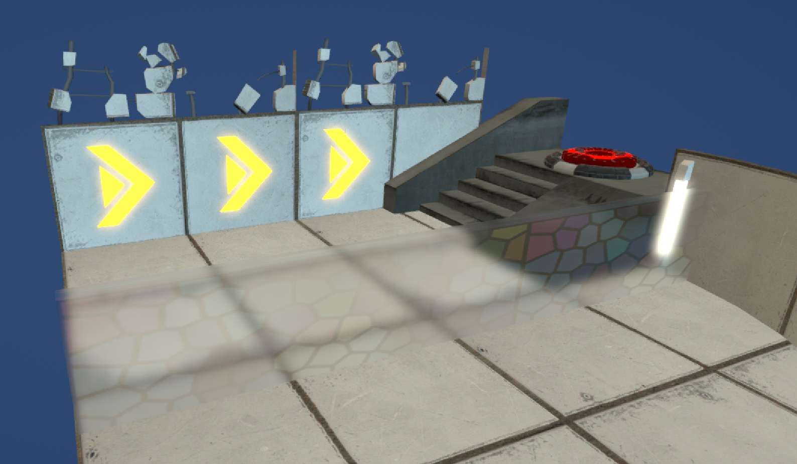

# Extending LWRP
Examples for extending the LWRP

## Blurry Refractions
Ported the "Blurry Refractions" sample from the [Graphics Command Buffers page](https://docs.unity3d.com/Manual/GraphicsCommandBuffers.html)

## Per-Object Bloom

Open the Sample scene to see them both working together.

Notes on extending the LRWP in general can be found in the wiki of these repo.

